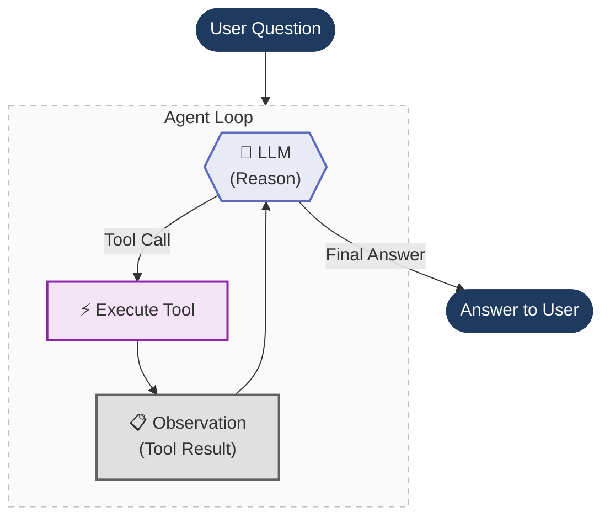

# Agents Under the Hood

**Peeling back the layers of a LangChain agent — from high-level abstractions down to raw prompt engineering.**

In this section we build the **same shopping assistant agent** three different ways. Each time we remove a layer of abstraction, so you can see exactly what's happening underneath.

## The Big Idea

Every AI agent — whether built with LangChain, LlamaIndex, CrewAI, or from scratch — follows the same core loop. We build it three times, each time peeling off a layer:

1. **Start with LangChain** — this is how you'd normally build an agent. `@tool`, `bind_tools()`, `init_chat_model()`. It just works. But what's actually happening underneath?
2. **Peel off LangChain** — build the same agent from scratch using only the Ollama SDK. Now you see what LangChain was doing for you: hand-written JSON schemas, manual message routing, raw tool dispatch.
3. **Peel off function calling** — go even deeper. Modern LLMs have built-in function calling, but that's a recent feature (June 2023). Before that, agents worked through pure prompt engineering: the **ReAct pattern**. We strip away function calling entirely and build it with just a prompt template and regex.

```
┌─────────────────────────────────────────────┐
│  File 1: LangChain                          │  ← @tool, bind_tools(), ToolMessage
│  ┌────────────────────────────────────────┐  │
│  │  File 2: Raw Function Calling          │  │  ← Hand-written JSON schemas, ollama.chat()
│  │  ┌─────────────────────────────────┐   │  │
│  │  │  File 3: Raw ReAct Prompt       │   │  │  ← Prompt template, regex, scratchpad
│  │  └─────────────────────────────────┘   │  │
│  └────────────────────────────────────────┘  │
└─────────────────────────────────────────────┘
```

Each file is self-contained and runnable on its own.

---

## The Agent Loop

At their core, all three implementations share the same loop — the agent reasons, picks a tool, executes it, observes the result, and repeats until it has a final answer:



What changes across the three files is **how** each step is implemented:

| Step | File 1 (LangChain) | File 2 (Raw Function Calling) | File 3 (Raw ReAct) |
|------|------|------|------|
| **Reason** | LLM returns structured `tool_calls` | LLM returns structured `tool_calls` | LLM outputs text: `Thought: ... Action: ...` |
| **Parse** | `ai_message.tool_calls[0]` | `message.tool_calls[0].function` | Regex: `r"Action:\s*(.+)"` |
| **Execute** | `tool.invoke(args)` | `tools[name](**args)` | `tools[name](*args)` |
| **Observe** | Append `ToolMessage` | Append `{"role": "tool"}` dict | Append to scratchpad string |
| **Finish** | No tool calls in response | No tool calls in response | `"Final Answer:"` found in text |

---
